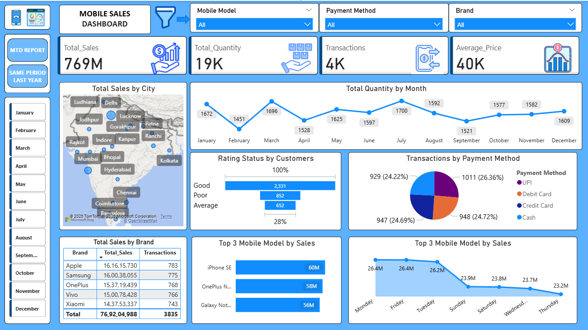
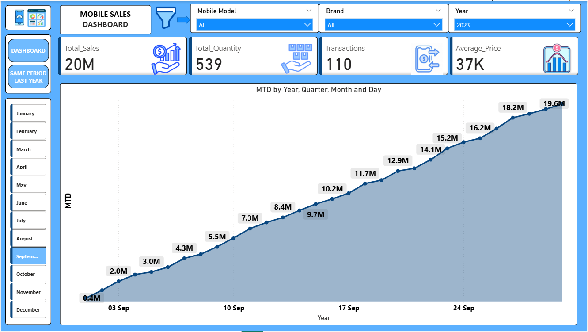
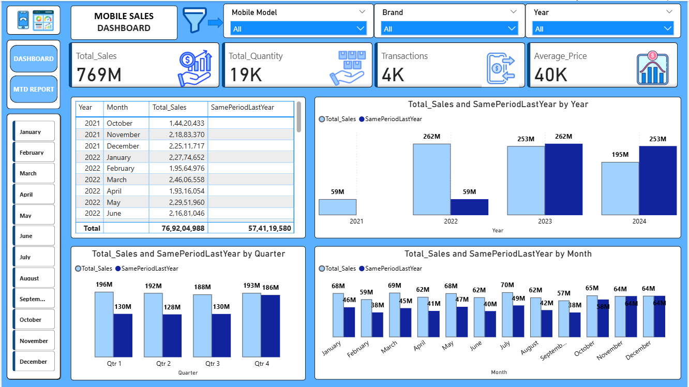

# Mobile-Sales-Dashboard-using-Power-BI
Interactive Power BI dashboard analyzing mobile sales performance by brand, model, region, and year with MTD and YoY insights.

## Overview
This Power BI dashboard analyzes mobile sales data to uncover insights on brand performance, regional trends, payment behavior, and customer satisfaction. The dashboard is fully interactive, with navigation buttons that allow users to explore MTD performance and year-over-year comparisons.

## Tools Used
- **Power BI Desktop** – for building interactive dashboards and reports  
- **Excel/CSV** – as the primary data source  
- **Power Query** – for data cleaning and transformation  
- **DAX (Data Analysis Expressions)** – for creating calculated measures such as Total Sales, Total Quantity, Average Price, MTD, Total Transactions, and Same Period Last Year

## Key Insights
- Total Sales: ₹769M | Total Quantity: 19K | Transactions: 4K  
- Top Brands: Apple (₹161M), Samsung (₹160M), OnePlus (₹157M)  
- Highest Sales Regions: Bangalore, Mumbai, Delhi  
- Top Models: iPhone SE, OnePlus Nord, Galaxy Note  
- Payment Mode Split: UPI (26%), Debit Card (25%), Credit Card (25%), Cash (24%)  
- Consistent Year-over-Year sales growth from 2021 to 2024  

## Dashboard Pages
1. **Dashboard Overview** – Overall KPIs, city map, brand & payment insights  
2. **MTD Report** – Month-to-date sales performance with daily progress  
3. **Same Period Last Year** – YoY comparison by month and quarter  

## Dashboard Previews
| Main Dashboard | MTD Report | YoY Comparison |
|----------------|-------------|----------------|
|  |  |  |

## How to Use
1. Download the `.pbix` file  
2. Open it in Power BI Desktop  
3. Explore the visuals and use filters for deeper insights  

---

⭐ *Created by [Dhanshree Kawade](#)*  
